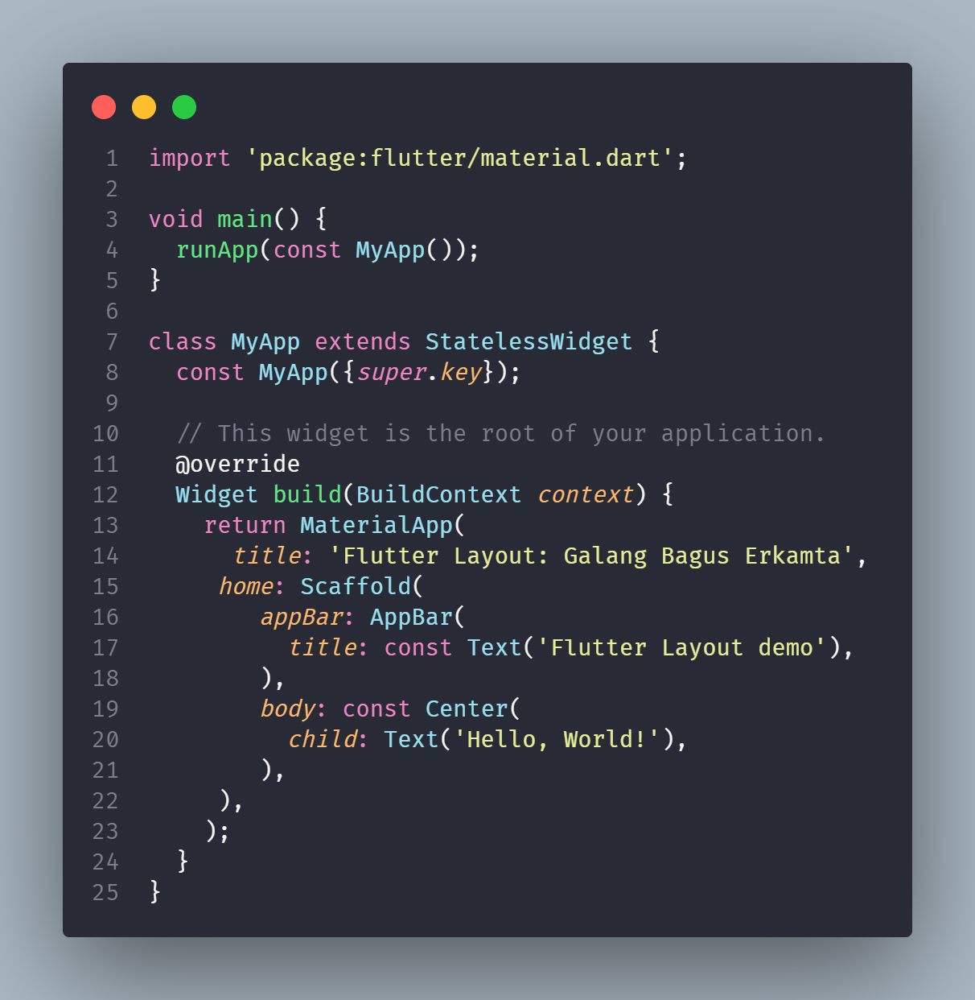
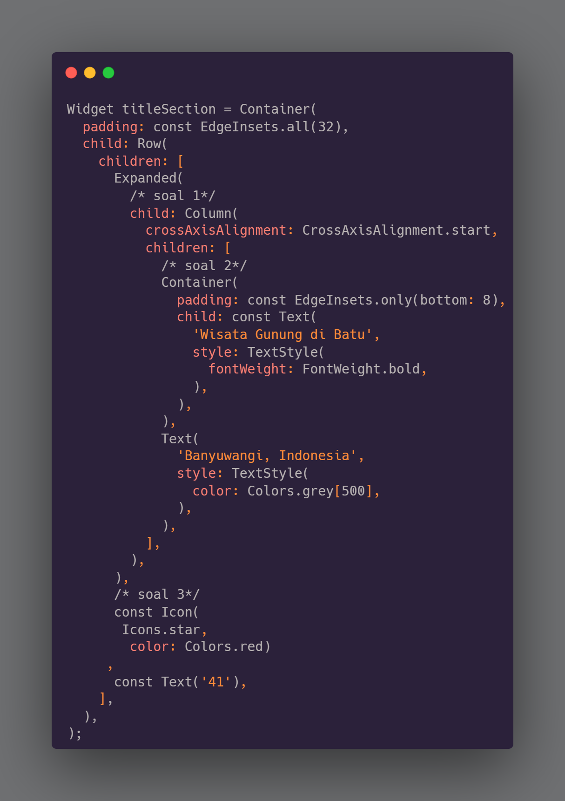
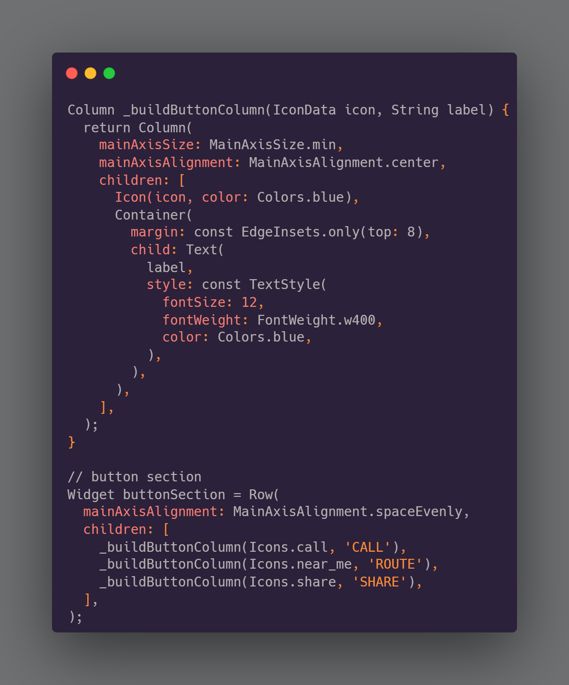
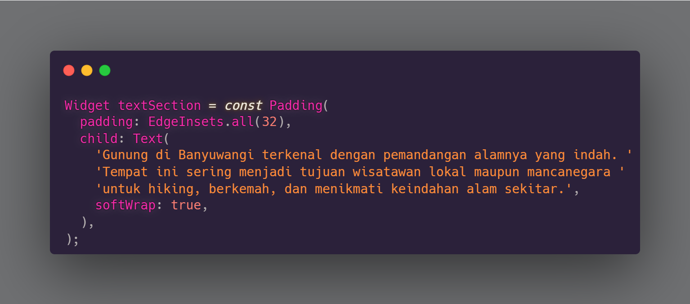
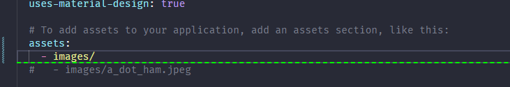
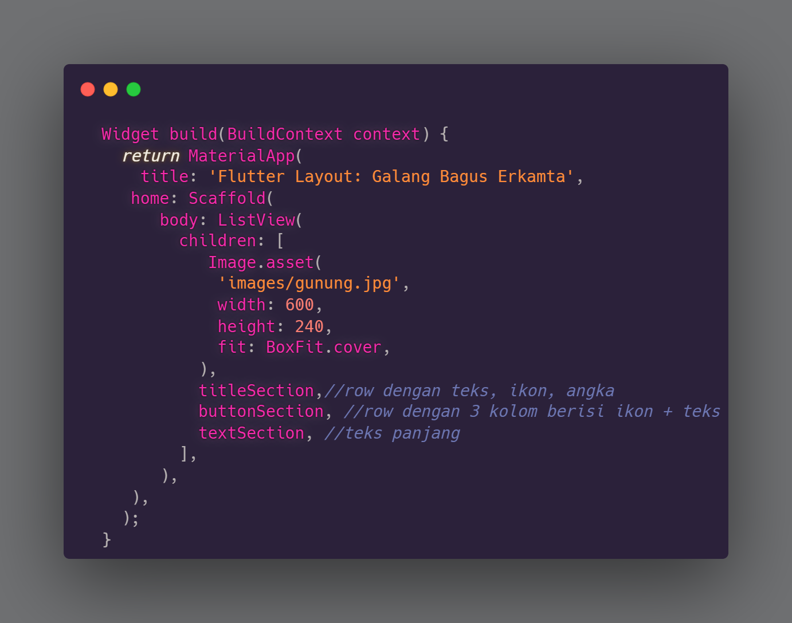

# dokumentasi praktikum flutter_layout_nav

Selesaikan Praktikum 1 sampai 4, lalu dokumentasikan dan push ke repository Anda berupa screenshot setiap hasil pekerjaan beserta penjelasannya di file README.md!

## Langkah 1: Buat Project Baru
 Buatlah sebuah project flutter baru dengan nama layout_flutter. Atau sesuaikan style laporan praktikum yang Anda buat.

## Langkah 2: Buka file lib/main.dart
Buka file main.dart lalu ganti dengan kode berikut. Isi nama dan NIM Anda di text title.
 

## langkah 3:Implementasi title row

membuat wigdet tile section yang berisi judul,lokasi,dan icon bintang.

 

## langkah 4:implementasi Implementasi button row
 membuat method column _buidButtonColumn() yang memiliki parameter warna,icon,dan text, kemudian membuat wigdet buttonSection untuk menambahkan icon lansung ke kolom

 

## langkah 4: Implementasi text section
menetukan bagian teks sebagai variabel. Masukkan teks ke dalam Container dan tambahkan padding di sepanjang setiap tepinya

 

## langkah 5: menambahkan assets images
 

## langkah 6: implementasi image section 
 disini saya membuat image section di children, kemudian menambahkan section yang sudah dibuat
 ditaruh dibawah image section. dan ubah body yang awalnya Column menjadi ListView, agar bisa discroll.
 
